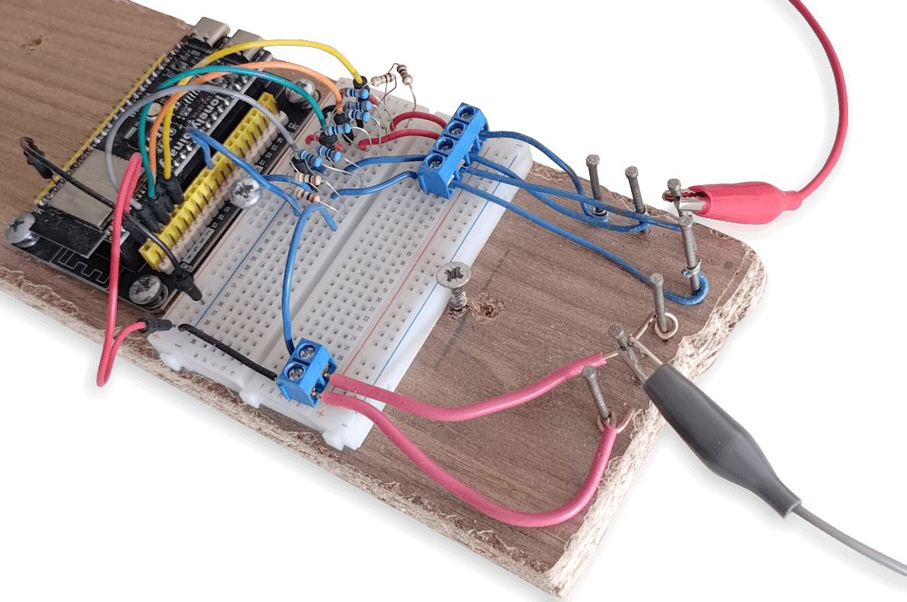
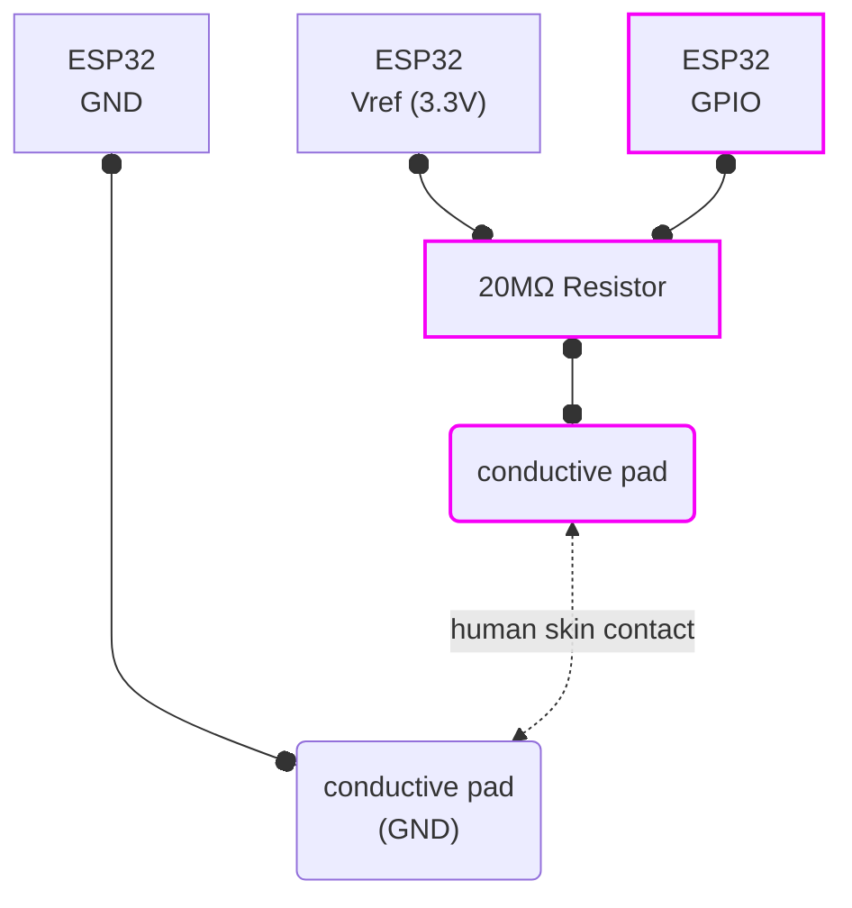
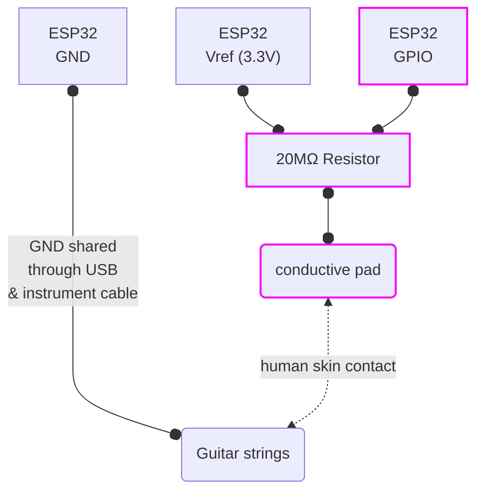

TODO : finish writing this doc

# ScrapOrchestra Midi Controller


*a basic solder-less prototype with resistors and a breadboard*

<hr>

This is a minimal port of Sparkfun [MaKeyMakey](https://github.com/sparkfun/MaKeyMaKey) for ESP32S3. Which uses high-impedance resistors ( ~ 20МΩ ) and digital filtering to detect contact through media like human skin. 

This version is different in that it exposes a USB-MIDI device instead of the keyboard/mouse HID used in the original code. 

I picked ESP32S3 because I already had a couple of those boards available. But given the simplicity of the code it should work with many other versions as long as they support USB device stack. 


## Usage

Although it was primarily made to be used in conjunction with a Raspberry Pi running [ScrapOrchestra](https://github.com/OlivierSch755/scraporchestra), it can still work as a standalone USB MIDI device.
In which case default config will have it send MIDI *note on* events matching common MIDI drum notes, such as kick (36) and snare (38) drums... (those are on channel 9 (zero-indexed)).


## Build

Project requires [ESP-IDF 5.4](https://dl.espressif.com/dl/esp-idf/)

Once installed and sourced, simply follow the regular ESP-IDF build steps:

```sh

git clone https://github.com/OlivierSch755/scraporchestra_midi_controller
cd scraporchestra_midi_controller

# fetch dependencies (tinyusb libs) and build
idf.py build

# flash the code on connected ESP32S3
idf.py flash

# open debug console if needed
idf.py monitor

```

## Schematics 

To add more inputs, simply duplicate the pink elements. 



Note that if you are using the controller with a USB connection to a Raspberry Pi 4 with a HifiBerry DAC (or DAC+ADC) you can skip the whole GND line. 

The reason for this is that:
* ESP32 GND = USB GND
* USB GND = RCA GND (provided you do not use galvanic isolation)
* RCA GND = preamp GND
* preamp GND = Guitar GND

So basically anything conductive on the guitar (strings included) is already acting as a GND pad. 

Therefore, this uncommon but interesting layout is possible: 




