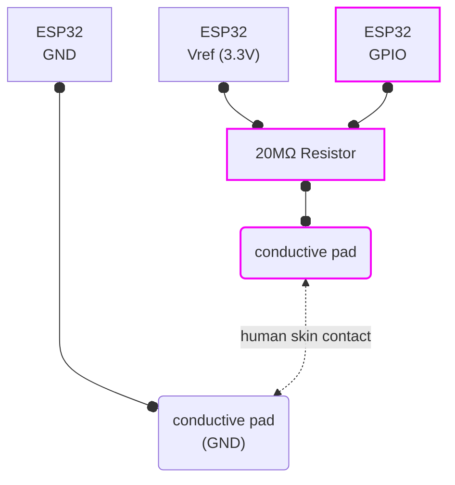

TODO : finish writing this doc


This is a minimal port of Sparkfun [MaKeyMakey](https://github.com/sparkfun/MaKeyMaKey) for ESP32S3. Which uses high-impedance resistors ( ~ 20МΩ ) and digital filtering to detect contact through media like human skin. 

This version is different in that it exposes a USB-MIDI device instead of the keyboard/mouse HID used in the original code. 

I picked ESP32S3 because I already had a couple of those boards available. But given the simplicity of the code it should work with many other versions as long as they support USB device stack. 


## Build

Project requires [ESP-IDF 5.4](https://dl.espressif.com/dl/esp-idf/)

Once installed and sourced, simply follow the regular ESP-IDF steps:

```sh

git clone https://github.com/OlivierSch755/scraporchestra_midi_controller
cd scraporchestra_midi_controller

# fetch dependencies (tinyusb libs) and build
idf.py build

# flash the code on connected ESP32S3
idf.py flash

# open debug console if needed
idf.py monitor

```

## Schematics 

To add more inputs, simply duplicate the pink elements. 


